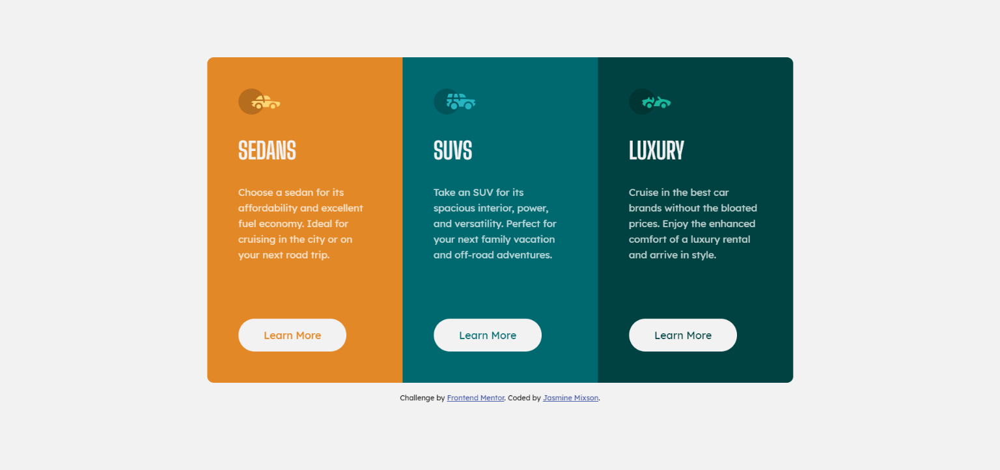

# Frontend Mentor - 3-column preview card component solution

This is a solution to the [3-column preview card component challenge on Frontend Mentor](https://www.frontendmentor.io/challenges/3column-preview-card-component-pH92eAR2-). Frontend Mentor challenges help you improve your coding skills by building realistic projects.

## Table of contents

- [Overview](#overview)
  - [The challenge](#the-challenge)
  - [Screenshots](#screenshots)
  - [Links](#links)
- [My process](#my-process)
  - [Built with](#built-with)
  - [What I learned](#what-i-learned)
  - [Continued development](#continued-development)
  - [Useful Resources](#useful-resources)
- [Author](#author)

## Overview

### The challenge

- View the optimal layout depending on their device's screen size
- See hover states for interactive elements

### Screenshots

|                Desktop Version                |               Mobile Version                |
| :-------------------------------------------: | :-----------------------------------------: |
|  |  |

### Links

- Solution URL: [https://www.frontendmentor.io/solutions/card-component-using-css-grid-YjE47te4L](https://www.frontendmentor.io/solutions/card-component-using-css-grid-YjE47te4L)
- Live Site URL: [https://jmixson-3-column-card-component.netlify.app/](https://jmixson-3-column-card-component.netlify.app/)

## My process

### Built with

- HTML5
- CSS custom properties
- Flexbox
- CSS Grid

### What I learned

I gained a better understanding of viewport units, specifically `vh` when trying to create certain layouts.

### Continued development

I will refine my flexbox skills and my understanding of viewpoint sizing units.

## Useful Resources

- [CSS fix for 100vh in mobile WebKit](https://allthingssmitty.com/2020/05/11/css-fix-for-100vh-in-mobile-webkit/) - used to figure out how to set the height while using flexbox
- [Fun with Viewport Units](https://css-tricks.com/fun-viewport-units/) - used to example viewport units
- [Box Sizing | CSS-Tricks](https://css-tricks.com/box-sizing/) - used to set box sizing property on all elements for better sizing

## Author

- Website - [https://jasminemixson.com/](https://jasminemixson.com/)
- Frontend Mentor - [@JMixson](https://www.frontendmentor.io/profile/JMixson)
- Github - [@JMixson](https://github.com/jmixson)
