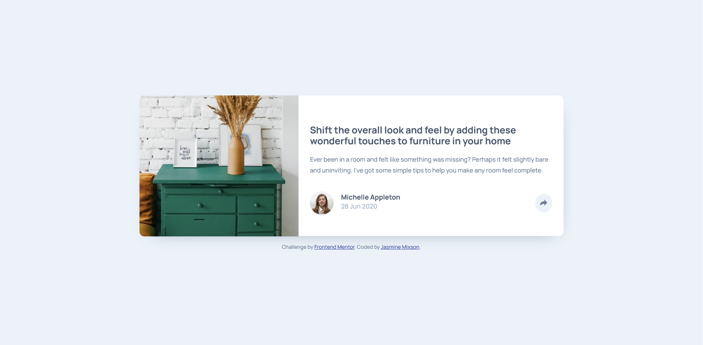
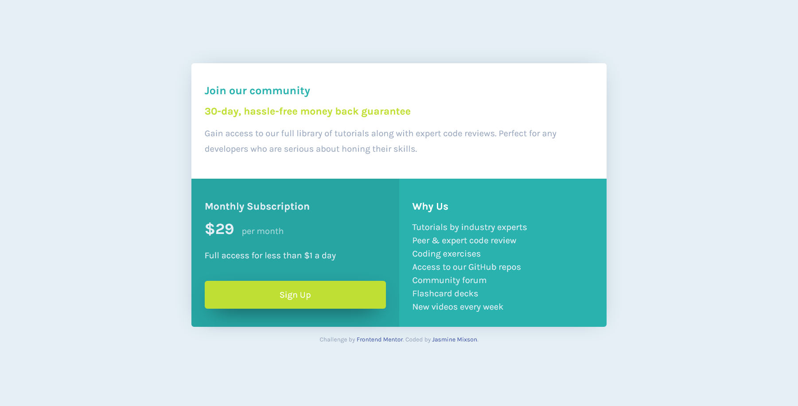

# Frontend Mentor

A collection of Frontend Mentor challenges.

## Completed Challenges

- [3-Column Preview Card Component](#3-column-preview-card-component)
- [Article Preview Component](#article-preview-component)
- [Single Price Grid Component](#single-price-grid-component)

### 3-Column Preview Card Component

  <h4>
    <a href="https://jmixson-3-column-card-component.netlify.app/">
      Demo
    </a>
     | 
    <a href="https://www.frontendmentor.io/solutions/card-component-using-css-grid-YjE47te4L">
      Solution
    </a>
     | 
    <a href="https://www.frontendmentor.io/challenges/3column-preview-card-component-pH92eAR2-">
      Challenge
    </a>
     | 
    <a href="https://github.com/JMixson/frontendmentor/tree/main/3-column-preview-card-component">
      GitHub
    </a>
  </h4>

#### The challenge

Users should be able to:

- View the optimal layout depending on their device's screen size
- See hover states for interactive elements

#### Built with

- Semantic HTML5 markup
- CSS custom properties
- Flexbox
- CSS Grid

---

### Article Preview Component

  <h4>
    <a href="https://jmixson-article-preview-component.netlify.app/">
      Demo
    </a>
     | 
    <a href="https://www.frontendmentor.io/solutions/article-preview-using-flexbox-4JHJuSUwZ">
      Solution
    </a>
     | 
    <a href="https://www.frontendmentor.io/challenges/article-preview-component-dYBN_pYFT">
      Challenge
    </a>
     | 
    <a href="https://github.com/JMixson/frontendmentor/tree/main/article-preview-component">
      GitHub
    </a>
  </h4>

#### The challenge

Users should be able to:

- View the optimal layout for the component depending on their device's screen size
- See the social media share links when they click the share icon

#### Built with

- Semantic HTML5 markup
- CSS custom properties
- Flexbox
- Mobile-first workflow

---

### Single Price Grid Component

  <h4>
    <a href="https://jmixson-single-price-grid-component.netlify.app/">
      Demo
    </a>
     | 
    <a href="https://www.frontendmentor.io/solutions/price-grid-using-css-grid-rtHSLUynV">
      Solution
    </a>
     | 
    <a href="https://www.frontendmentor.io/challenges/single-price-grid-component-5ce41129d0ff452fec5abbbc">
      Challenge
    </a>
     | 
    <a href="https://github.com/JMixson/frontendmentor/tree/main/single-price-grid-component">
      GitHub
    </a>
  </h4>

#### The challenge

Users should be able to:

- View the optimal layout for the component depending on their device's screen size
- See a hover state on desktop for the Sign Up call-to-action

#### Built with

- Semantic HTML5 markup
- CSS custom properties
- CSS Grid
- Flexbox
- Mobile-first workflow
