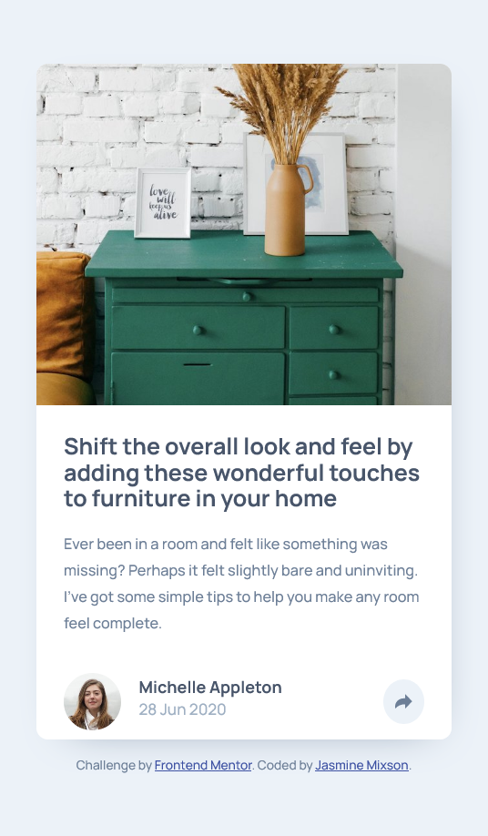
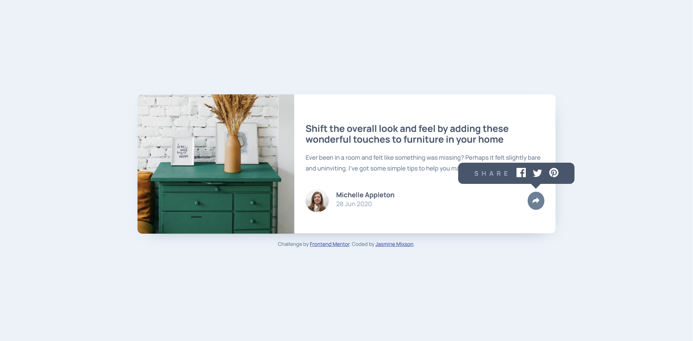

# Frontend Mentor - Article preview component

This is a solution to the [Article preview component challenge on Frontend Mentor](https://www.frontendmentor.io/challenges/article-preview-component-dYBN_pYFT). Frontend Mentor challenges help you improve your coding skills by building realistic projects.

## Table of contents

- [Overview](#overview)
  - [The challenge](#the-challenge)
  - [Screenshot](#screenshot)
  - [Links](#links)
- [My process](#my-process)
  - [Built with](#built-with)
  - [What I learned](#what-i-learned)
  - [Continued development](#continued-development)
  - [Useful resources](#useful-resources)
- [Author](#author)
- [Acknowledgments](#acknowledgments)

## Overview

### The challenge

Users should be able to:

- View the optimal layout for the component depending on their device's screen size
- See the social media share links when they click the share icon

### Screenshot

|          Desktop Version           |          Mobile Version          |
| :--------------------------------: | :------------------------------: |
|  |  |

|             Desktop Hover Version              |             Mobile Hover Version             |
| :--------------------------------------------: | :------------------------------------------: |
|  |  |

### Links

- Solution URL: [https://www.frontendmentor.io/solutions/article-preview-using-flexbox-4JHJuSUwZ](https://www.frontendmentor.io/solutions/article-preview-using-flexbox-4JHJuSUwZ)
- Live Site URL: [https://jmixson-article-preview-component.netlify.app/](https://jmixson-article-preview-component.netlify.app/)

## My process

### Built with

- Semantic HTML5 markup
- CSS custom properties
- Flexbox
- Mobile-first workflow

### What I learned

I learned how to create a tooltip and more about absolute positioning. Besides that, I also became more familiar with Firefox's developer tools and different ways to check pseudo elements/classes in both Chrome and Firefox dev tools.

### Continued development

I'm still working to improve my absolute positioning skills, especially when scaling to different sizes. I also plan on learning how to manipulate SVGs in CSS and more about accessibility.

### Useful resources

- [CSS Tooltip](https://www.w3schools.com/css/css_tooltip.asp) - This page describes how to create a style a tooltip.
- [Learn Flexbox for free](https://scrimba.com/learn/flexbox) - A Scrimba course for flexbox taught by Per Harald Borgen.
- [CSS The object-fit Property](https://www.w3schools.com/css/css3_object-fit.asp) - A reference to the CSS `object-fit` property.
- [Change Color of SVG on Hover](https://css-tricks.com/change-color-of-svg-on-hover/) - This article describes the different ways to change the color of an svg on hover.
- [CSS in Action: Invisible Content Just for Screen Reader Users](https://webaim.org/techniques/css/invisiblecontent/) - This article examples how to hide content in a way that is still accessible to screen readers.

## Author

- Website - [https://jasminemixson.com/](https://jasminemixson.com/)
- Frontend Mentor - [@JMixson](https://www.frontendmentor.io/profile/jmixson)
- Github - [@JMixson](https://www.github.com/jmixson)

## Acknowledgments

- [Box-Shadow CSS Generator](https://html-css-js.com/css/generator/box-shadow/) - Tool used to generate CSS box-shadow properties. I used this to help quickly generate a box shadow for my article component.
- [Normalize.css](https://necolas.github.io/normalize.css/) - A CSS reset file that improves cross-browser consistency.
